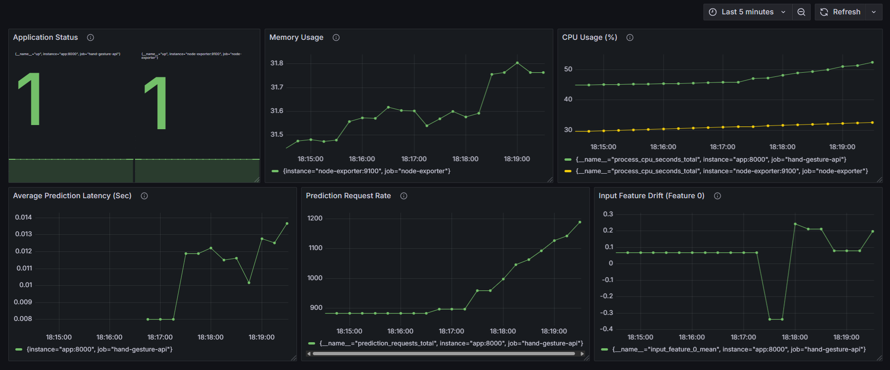

# 🖐️ Real-Time Hand Gesture Recognition API

This repository contains the FastAPI-based backend for a real-time hand gesture recognition system. It accepts MediaPipe hand landmarks as input and returns the predicted gesture along with confidence. It also includes Prometheus-based monitoring to track API performance and model behavior.

---

## 🚀 Features

- 🔍 Predicts hand gestures in real-time from landmark coordinates.
- ⚙️ Trained on the HaGRID dataset with optimized feature engineering and ML models (e.g., XGBoost).
- 📈 Integrated with Prometheus and Grafana for performance and usage monitoring.
- 📊 Visual monitoring dashboard showing API health and prediction performance.
- 🐳 Containerized with Docker for easy deployment.

---

## 🧠 Model Input

The model uses 21 MediaPipe landmarks (x, y, z coordinates) and converts them into meaningful, normalized features for gesture classification.

---

## 📉 Monitoring with Prometheus & Grafana

This API exposes several Prometheus metrics at `/metrics`. A Grafana dashboard visualizes these in real-time.

### 🖼️ Sample Dashboard

### 📌 Monitored Metrics:

| **Metric Name (Display)**         | **Metric Type** | **Reason for Choosing**                                                                                 |
|----------------------------------|------------------|----------------------------------------------------------------------------------------------------------|
| Up                       | Stat             | Confirms whether the API service is live and healthy. Essential for uptime monitoring and alerting.      |
| Memory Usage (%)                 | Time Series      | Tracks real-time memory usage to detect memory leaks or performance degradation.                         |
| CPU Usage (%)               | Time Series      | Measures CPU consumption by the API process to identify inefficiencies or overuse of system resources.   |
| Avg. Prediction Latency (1 min)  | Time Series      | Monitors the average latency of predictions, highlighting delays or bottlenecks in the inference process.|
| Total Prediction Requests        | Time Series      | Counts the number of prediction requests, giving insight into API usage and load patterns.               |
| Input Feature 0 Mean             | Time Series      | Observes the distribution of the first input feature to detect anomalies or data drift in real-time.     |
